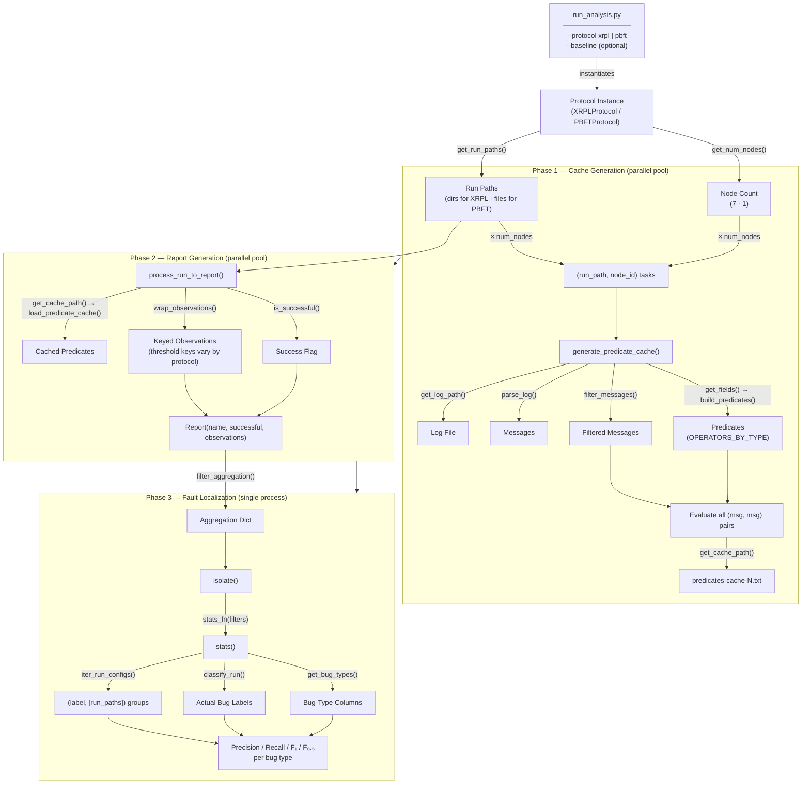
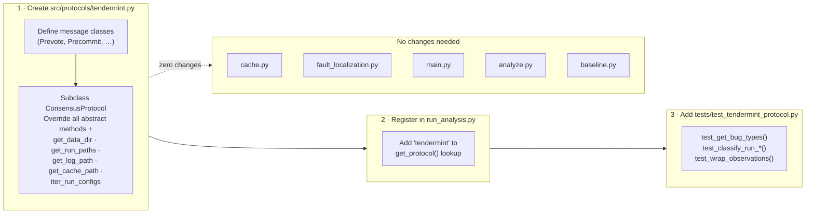

# Multi-Protocol Architecture

## What Changed to Support Multiple Protocols

- **Introduced a `ConsensusProtocol` abstract base class** that defines a single interface covering all protocol-specific knowledge — message types and fields, log parsing, file path conventions, run classification, and observation encoding — so the pipeline never hard-codes protocol details.

- **Refactored the isolation pipeline** (`cache.py`, `main.py`, `analyze.py`, `baseline.py`) to call protocol methods instead of XRPL-specific logic: predicate generation uses `get_fields()`, file discovery uses `get_run_paths()` and `get_log_path()`/`get_cache_path()`, and scoring uses `classify_run()`, `get_bug_types()`, and `iter_run_configs()`.

- **Implemented two concrete protocol adapters** — `XRPLProtocol` (7 nodes, UNL-partition thresholds, 3 bug types, `data/` directory) and `PBFTProtocol` (1 log file per run, single threshold, 5 descriptive bug types, `out/` directory) — each encapsulating the full protocol-specific oracle and file layout with no changes to shared code.

- **Added a unified CLI entry point** (`run_analysis.py --protocol xrpl|pbft`) that instantiates the right protocol and routes to either the message-based or baseline pipeline, making the tool protocol-agnostic at every level from data discovery to final scoring output.

## How Protocol Injection Works

The protocol object is created once in `run_analysis.py` and threaded through the pipeline via three distinct mechanisms depending on the execution context:

1. **Direct argument** — `run_message_based_analysis(protocol=protocol)` and `run_baseline_analysis(protocol=protocol)` receive the instance as a plain function argument. Inside the pipeline, `process_run_to_report` is called as `pool.imap_unordered(..., [(path, protocol) for path in paths])`, so each worker receives the protocol object directly in its argument tuple.

2. **Pool initializer for cache workers** — `generate_predicate_cache` takes only `(path, node_id)` and cannot carry extra arguments through `imap_unordered`. Instead, the pool is created as `Pool(initializer=set_protocol, initargs=(protocol,))`, which calls `set_protocol(protocol)` in every worker process before any task runs, storing the protocol in a module-level `_PROTOCOL` global inside `cache.py`. This is necessary because macOS Python uses `spawn` (not `fork`) for multiprocessing — globals are not inherited, so the initializer is the only reliable way to share state with workers.

3. **Lambda closure for the scoring callback** — `stats()` is passed to `isolate()` as a callback that will be called later with only a `filters` list. To carry the protocol into that call without changing `isolate()`'s signature, the pipeline binds it at call-site via a closure: `stats_fn=lambda filters: stats(filters, protocol=protocol)`. The same pattern is used in `baseline.py`.

---

## Protocol Abstraction Layer

```mermaid
classDiagram
    class ConsensusProtocol {
        <<abstract>>
        ───── Data Discovery ─────
        +get_data_dir() str
        +get_run_paths() list[str]
        +iter_run_configs() Iterable
        ───── File Paths ─────
        +get_log_path(run_path, node_id) str
        +get_cache_path(run_path, node_id) str
        ───── Message Parsing ─────
        +get_fields() list[tuple]
        +get_num_nodes() int
        +parse_log(path) list
        +filter_messages(messages, node_id) list
        ───── Ground-Truth Oracle ─────
        +get_bug_types() list[str]
        +is_successful(run_path) bool
        +classify_run(run_path) set[str]
        ───── Observation Encoding ─────
        +wrap_observations(pred, nodes) dict
        +filter_aggregation(aggregation) dict
    }

    class XRPLProtocol {
        data_dir = "data/"
        num_nodes = 7
        bug_types = ["Incompatible", "Insufficient", "Agreement"]
        ─────────────────────────────
        Threshold: UNL partition sets
        ▸ SET_LOW  = {0,1,2,3,4}
        ▸ SET_HIGH = {2,3,4,5,6}
        ▸ 5 keys per predicate (> 0…4)
        ─────────────────────────────
        Log layout: run_dir/validator_N.txt
        Cache:      run_dir/predicates-cache-N.txt
        Config:     buggy-7-{c}-{d}-…/
        Excluded:   6 known-bad timestamps
    }

    class PBFTProtocol {
        data_dir = "out/"
        num_nodes = 1
        bug_types = ["Invalid Operation",
                     "Seq-No Replay",
                     "View-Change Fault",
                     "Partition Timeout",
                     "Split Brain"]
        ─────────────────────────────
        Threshold: single (> 0 replicas)
        ▸ 1 key per predicate
        ─────────────────────────────
        Log layout: config_dir/outN.txt (file = run)
        Cache:      config_dir/outN-predicates-cache-0.txt
        Config:     tests-D{d}-C{c}-{scope}/
        Excluded:   none
    }

    ConsensusProtocol <|-- XRPLProtocol
    ConsensusProtocol <|-- PBFTProtocol
```

---

## Pipeline Flow



---

## Adding a Third Protocol (e.g. Tendermint)


